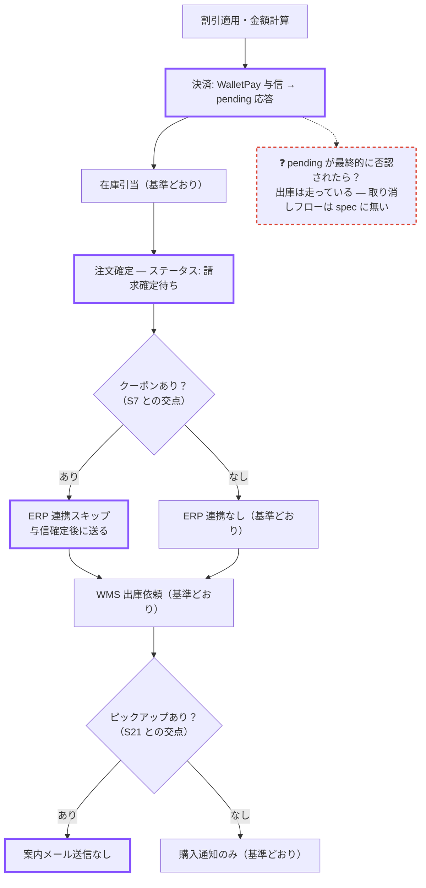
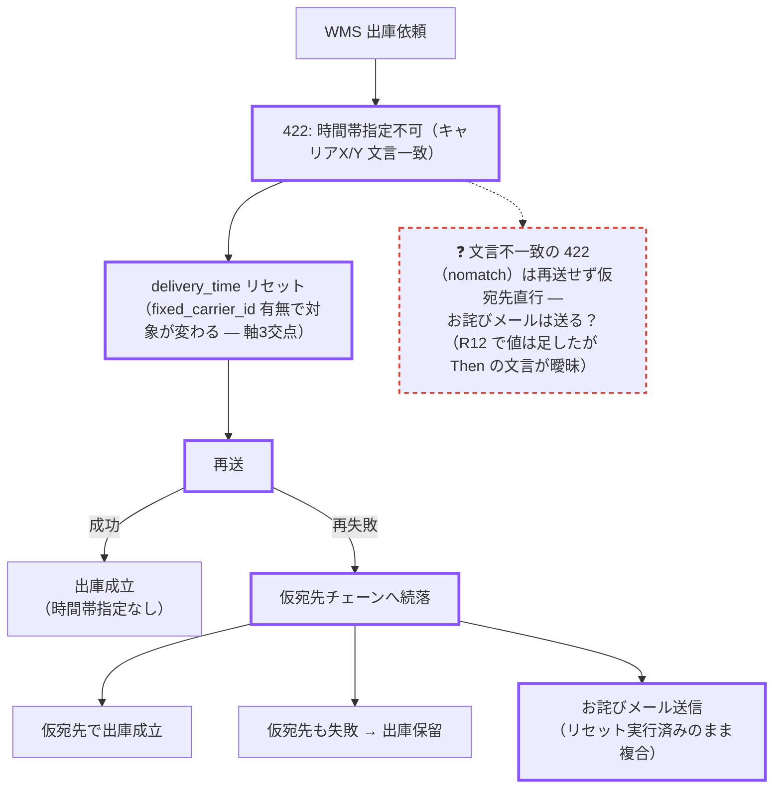

# シナリオ単位フローチャートのたたき台サンプル — cart-payment

壁打ち中、議題になっている B 行（またはレビュー指摘・依存交点）1件ごとに
エージェントが提示する想定のたたき台。1シナリオ = 1本のパス。

視覚語彙（案）:
- 実線枠 = 基準シナリオと同じ挙動のステップ（読み飛ばしてよい）
- 紫太枠 = このシナリオで挙動が変わるステップ（ここだけ読めばよい）
- 菱形 = このシナリオに絡む依存交点の条件分岐
- 赤破線 ❓ = spec 未裁定（壁打ちの議題）

## サンプル1 — B-4: wallet_pay 与信 pending（Covers: base + payment=S5）

壁打ちの問い方（想定）:
- 「太枠4つがこのシナリオの差分の全部 — B-4 の Then はこの4つを全部言っている？」
- 「❓: 与信否認の続落は chains に無い。B 行を足すか、スコープ外を明言するか」

## サンプル2 — B-15→B-17: WMS 422 再送 → 仮宛先続落（chain: S16 → S18）

壁打ちの問い方（想定）:
- 「続落後の状態は『リセット実行済み + お詫びメール送信済み + 仮宛先』の複合 — gate の manual 確認でこの複合状態を再現できる？」
- 「tfail（仮宛先も失敗）の後続は？ — 図の末端が裸で終わっている = spec の末端も裸」
